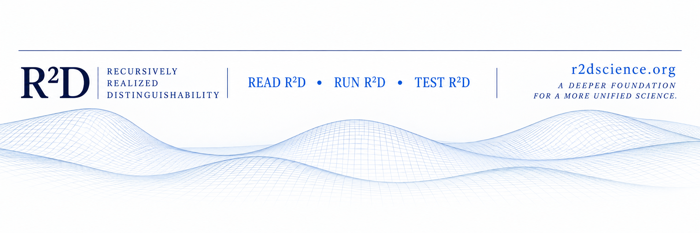
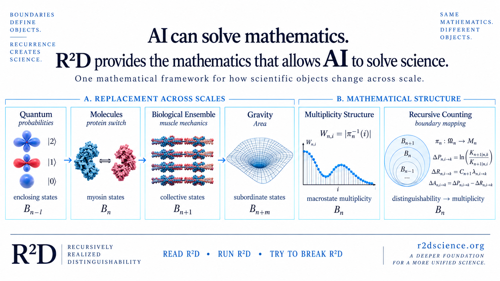

{width="100%"}

::: {.r2d-hero}

R2D SCIENCE

# Use AI to solve science.

AI can solve mathematics.     
**R2D is the mathematics that allows AI to solve science.**

Science has mathematics that describes what an object does.  
**R2D provides mathematics that defines what an object is.**

[WHAT IS R2D? →](understand/what-is-r2d.qmd)

:::
::: {.r2d-pathways}
::: {.r2d-pathway}
### READ R2D
Learn the boundary-dependent mathematics behind the framework—from recursive counting and replacement to multiplicity, constraint, closure, and scale.  
[UNDERSTAND R²D](understand/index.qmd){.r2d-pathway-link}
:::
::: {.r2d-pathway}
### RUN R2D
Give R²D to an AI and use it to interrogate a scientific law, paradox, paper, or unsolved problem.  
[RUN R²D](run/index.qmd){.r2d-pathway-link}
:::
::: {.r2d-pathway}
### TEST R2D
See what happens when the same mathematical structure is applied to muscle, thermodynamics, quantum statistics, gravity, geometry, fluids, and biology.  
[EXPLORE APPLICATIONS](applications/index.qmd){.r2d-pathway-link}
:::
:::

Don't believe it. Try it.

#
## R2D at a glance

{width="100%"}
