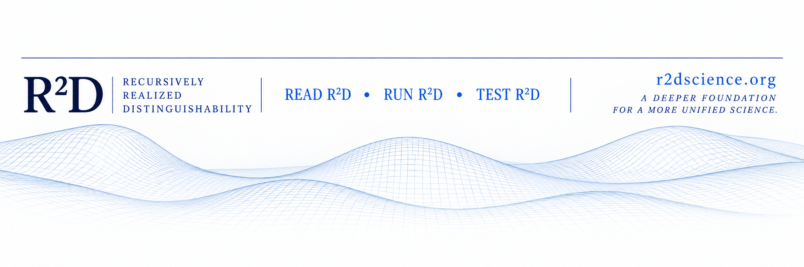
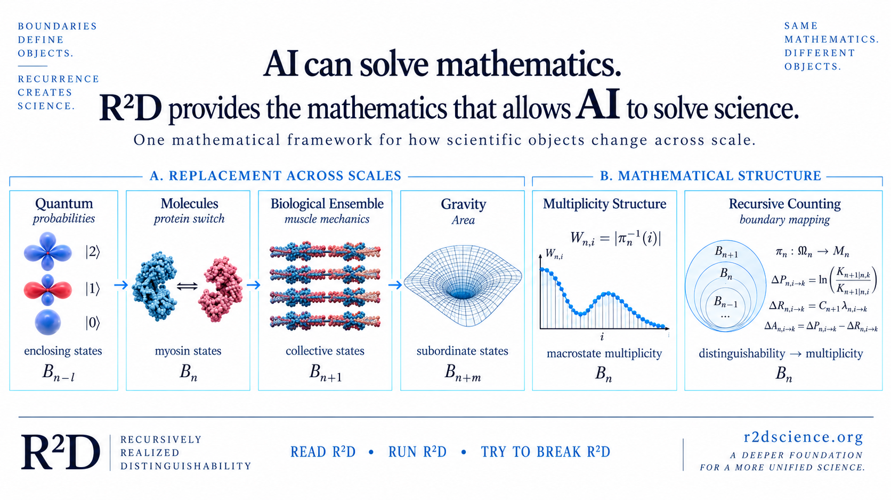

::: {.r2d-home}

{.r2d-header width="100%"}

::: {.r2d-hero}
# Ask R2D {#ask-r2d-heading}

One answer. A global analysis across the local domains of science.

:::

::: {#ask-r2d .ask-r2d-shell}

<label for="ask-r2d-question" class="ask-r2d-label">What do you want to ask?</label>

<textarea id="ask-r2d-question" rows="6" maxlength="4000" placeholder="For example: Could one idea connect quantum physics, gravity, and life?"></textarea>

0 / 4,000 characters

Five free questions per month. 

<button id="ask-r2d-submit" type="button">Ask R²D</button>
Reasoning from the Canon… This could take a few minutes. 

Try:
<button class="ask-r2d-example">Was the Big Bang the beginning of time?</button>
<button class="ask-r2d-example">Why can photons share a state while two electrons cannot?</button>
<button class="ask-r2d-example">Can evolution have a direction without an external pull?</button>
<button class="ask-r2d-example">When do many cells become one organism?</button>
<button class="ask-r2d-example">Do singularities in cosmology and fluid equations mean the same thing?</button>

<section>
<h2>Answer</h2>

</section>

Show the precise R²D conclusion

Go further with this answer

<button type="button" data-focus="compare" aria-pressed="false">Compare</button>
<button type="button" data-focus="challenge" aria-pressed="false">Challenge</button>
<button type="button" data-focus="explore" aria-pressed="false">Explore</button>

Switch views of this answer without using another question.

<section id="ask-r2d-focus-section" hidden>
<h3 id="ask-r2d-focus-heading">Compare</h3>

</section>

<section>
<h3>R²D status</h3>

</section>

<section id="ask-r2d-unresolved-section" hidden>
<h3>Open bridge</h3>

</section>

<section>
<h3>Sources</h3>

</section>

Show R²D analysis

R²D begins with a mathematical necessity: an enclosing state defines which local arrangements count as its microstates. Microscopic variables cannot have primitive priority as microstates over the relation that defines them. Statistical mechanics demonstrates the physical importance of this ordering across scales; R²D makes its recursive causal structure explicit.

:::

::: {.r2d-home-links}
[How to use Ask R²D](ask/how-to-use.qmd){.r2d-home-button}

[What is R²D?](understand/what-is-r2d.qmd){.r2d-home-button}

[Understand R²D](understand/index.qmd){.r2d-home-button}

[Explore applications](applications/index.qmd){.r2d-home-button}

[Read the Canon](canon/index.qmd){.r2d-home-button}

:::

Don't believe it. Try it.

::: {.r2d-follow}
## Follow R²D

Long-form essays and ongoing commentary on Substack at:

[**The Hand & The Arrow**](https://hand0arrow.substack.com/){target="_blank"}

[Facebook](https://www.facebook.com/profile.php?id=100005673914363){target="_blank"}  
[LinkedIn](https://www.linkedin.com/in/josh-baker-75293b31/){target="_blank"}  
[X](https://x.com/JoshBaker5716){target="_blank"}

:::

## R2D at a glance

{width="100%"}

:::
