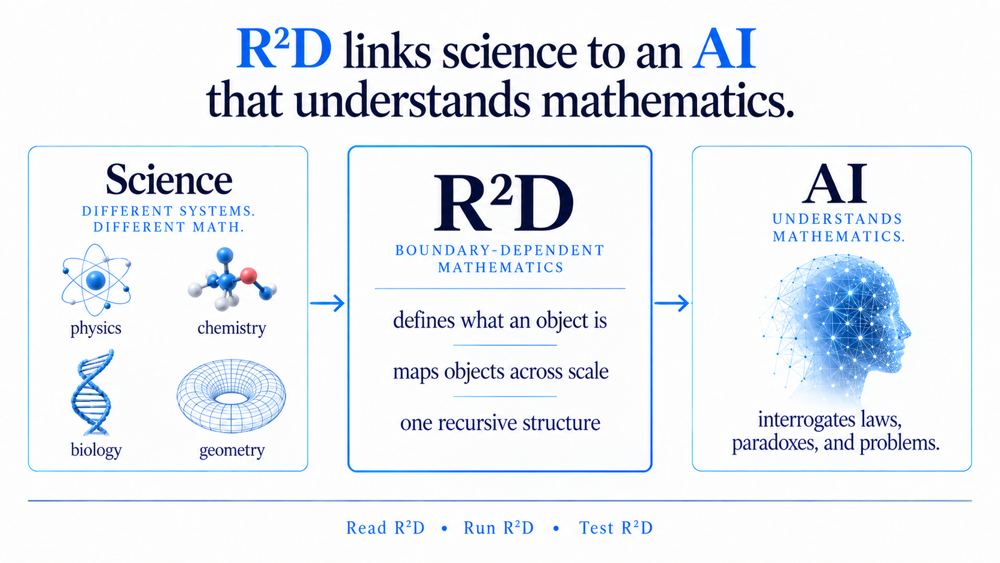

## AI can solve mathematics. R²D is the mathematics that allows AI to solve science.

Science has a math that describes what an object does.  

**R²D provides a math that defines what an object is.**

{width="100%"}

We discovered R²D in muscle, where chemistry, thermodynamics, and mechanics apply to both a macroscopic muscle fiber and a microscopic myosin molecule. Science does not smoothly change across these scales; it describes muscle and a myosin molecule as two distinctly different objects.

**Science is boundary dependent. It does not privilege any one object. It does not privilege any one scale.** 

The formal breakthrough was to define macrostate and microstate as boundary-dependent mathematical objects. Changing the boundary does not blur an object; it replaces its state domain. At one boundary, a water molecule is the scientific object. At another boundary, a glass of water replaces a water molecule as the scientific object. **R²D merely states that a glass of water is not a water molecule.**  

Once microstate and macrostate are properly defined, scientific paradoxes disappear and familiar scientific objects appear – not as physical objects but – as mathematical structures: thermodynamics before temperature and entropy, Fermi–Dirac statistics before fermions, Bose–Einstein statistics before bosons, area before radius, and quantum and gravitational horizons before quantum and gravitational phenomena.  

R²D gives AI something science doesn't provide: a single mathematical structure onto which chemistry, physics, biology, and geometry can all be deprojected. This is more than a proposal. We have spent years asking AI to break R²D by identifying inconsistencies with scientific laws across domains. AI consistently preserves both R²D and scientific laws. It breaks conventional ontologies.  

Upload R²D into an LLM. Give it a scientific law, a paradox, or an unsolved problem. Ask it to strip away the inherited physical ontology, recover the underlying mathematics, and see what follows.
